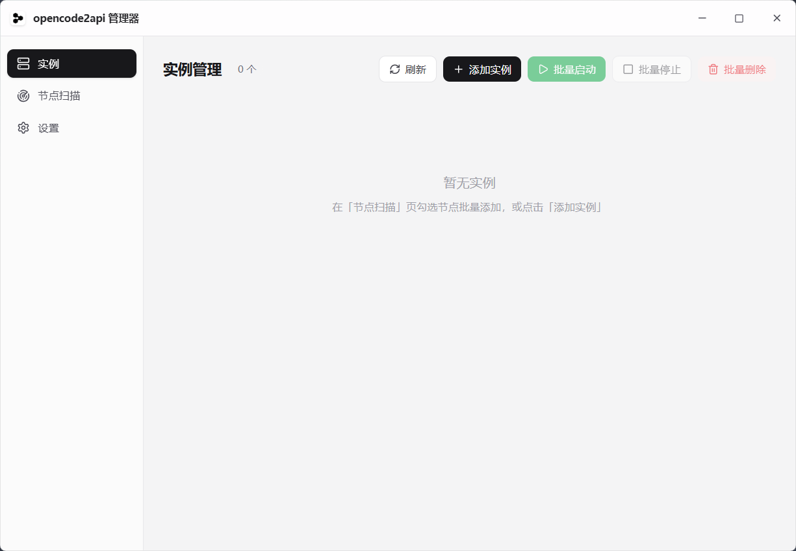

# opencode2api 管理器

> ⚠️ **仅供学习参考，非授权禁止商用**
> 本项目仅用于个人学习、研究与技术交流。**允许**非商业目的的学习、修改与传播分享；**禁止**任何形式的商业用途（收费服务、盈利产品、打包转售、变相收费等）。详见 [LICENSE](LICENSE)。使用即视为同意许可条款。
## 致谢

感谢[Sujinxin123](https://github.com/Sujinxin123)——本项目 v1.0.0 的「统一网关、免费额度实测健康检查、代理池健康检查、配置热更新、模型必填、同模型重试、批量并行启停」等核心能力均移植自该项目，是本次合并的基石。

特别感谢[FYHC1](https://github.com/FYHC1)——v1.0.2 修复了两个关键问题：sing-box 生成配置含非法 `transport {type:tcp}` 导致扫描时 sing-box 启动即退出，以及统一网关进程工作目录错位导致统计界面读不到网关流量（含按节点拆分 token 统计明细）。这两项修复直接消除了日常使用中的两个「硬伤」：节点扫描后 sing-box 不再一启动就崩，统一网关的 token 消耗在统计界面实时可见、并能按节点下钻到用量明细——每个节点的流量消耗一目了然。

- Go 代理核心源于 [`6Kmfi6HP/opencode2api`](https://github.com/6Kmfi6HP/opencode2api)
- 前端设计样式参考 Windsurf Account Manager


本地**多实例代理管理器**桌面应用（Windows exe）。每个"实例" = 一个 opencode2api 代理进程 + 一个 sing-box 出口，绑定不同代理节点，把 OpenAI / Anthropic / Responses 风格的请求转发到 OpenCode 上游，并可通过多实例 × 多节点分散请求、绕过按 IP 的频率限制。

UI 参照 Windsurf Account Manager 的浅色官网风格：Tauri 2 无边框窗口 + 自定义标题栏 + 侧边栏三页（实例 / 节点扫描 / 设置），关闭窗口最小化到托盘、实例继续运行。

> 本项目不是 OpenAI、Anthropic 或 OpenCode 的官方项目。请遵守上游服务条款，并只在你有权限的环境中使用。

## 效果图



## 功能

- **实例管理**：增/删/启/停/测试，批量操作；API 地址一键复制
- **节点扫描**：一键扫描全部节点（经 Clash 外部控制 + 本地 Verge profiles），按分组展示，结果分类（ok / config / socks / tls / upstream / timeout / other）与延迟；勾选可用节点批量添加为实例
- **多代理节点**：每实例自动生成 sing-box 配置走所选节点（trojan / vless / vmess / shadowsocks / ws），opencode2api 的 SOCKS5 指向 sing-box
- **Clash 集成**：配置 Clash 外部控制地址与密钥即可拉取节点；也可读取 Clash Verge 本地 profiles 目录
- **触摸保活**：系统托盘常驻，关闭窗口实例继续代理
- **设置**：Clash 外部控制、实例默认密码、开机自启、二进制状态

## 用法

1. 启动 `opencode2api-manager.exe`（首次运行自动在 exe 旁生成 `bin/` 目录，内含 opencode2api 与 sing-box 子程序）
2. **设置**页填 Clash 外部控制地址（默认 `http://127.0.0.1:9097`）与密钥
3. **节点扫描**页 →「一键扫描全部」→ 勾选可用 →「添加选中为实例」
4. **实例**页 →「启动」→ 用 `http://127.0.0.1:{实例端口}/v1` 作为 API 地址

## 轻量化原则

本项目保持轻量、克制的设计取向：

- **少依赖**：不引入图表库、状态管理库等重组件；分析/可视化用纯 CSS 实现，新功能优先用现有技术栈（Tauri command + React + Tailwind）完成。
- **按需添加**：只加有实际使用价值的功能，不为「看起来丰富」堆功能；功能取舍以使用场景为准。
- **体积敏感**：UI 与运行时保持精简，避免无意义的依赖膨胀拖慢启动、增大打包体积。

## 常见问题

使用中遇到问题？先看 [常见问题（FAQ）](docs/FAQ.md) —— 包含 `max_tokens` 超限报错、Token 统计疑问等。

## 构建与打包

依赖：Node.js ≥ 18、Rust（stable-x86\_64-pc-windows-msvc）、Windows 需要 MSVC Build Tools + Windows SDK。`bin/` 下的两个内嵌 exe 不入库，本地构建前需自行准备，见下文「内嵌二进制（bin/）」。

```bash
npm install
npm run tauri:build -- --no-bundle   # 产出 src-tauri/target/release/opencode2api.exe（含内嵌子程序）
bash scripts/make-portable.sh        # 组装 dist/opencode2api-manager-<ver>-portable.zip
```

### 内嵌二进制（bin/）

`bin/` 被 `.gitignore` 忽略，`opencode2api.exe` 与 `sing-box.exe` 均不入库，本地构建前需自行准备：

- `opencode2api.exe`：由本仓库 Go 源码构建（`go build -trimpath -ldflags "-s -w" -o bin/opencode2api.exe .`）
- `sing-box.exe`：从 [sing-box 官方 Release](https://github.com/SagerNet/sing-box/releases) 下载，当前与 CI 一致固定 v1.13.15

远程构建无需手动准备：GitHub Actions 会自动构建 Go 核心、下载 sing-box 并完成打包（见 `.github/workflows/build-release.yml`）。

开发热更：

```bash
npm install
npm run tauri:dev
```

## 数据目录

运行时数据（配置文件、实例清单、日志）存 `%APPDATA%\opencode2api-manager\`：


| 路径               | 说明                                  |
| ---------------- | ----------------------------------- |
| `config.json`    | 应用配置（Clash 外部控制、默认密码）               |
| `instances.json` | 实例清单                                |
| `runtime\`       | 各实例的运行目录与日志                         |
| （exe 旁）`bin\`    | 释放的 opencode2api.exe / sing-box.exe |


## 架构

```
┌─────────────────────────────────────────────┐
│  Tauri 2 前端（React + Tailwind）            │
│  实例 / 节点扫描 / 设置（invoke → command）    │
└──────────────────┬──────────────────────────┘
                   │ #[tauri::command]
┌──────────────────▼──────────────────────────┐
│  Rust 管理器（src-tauri/src）                 │
│  clash_yaml·singbox·opencode_cfg·instance·   │
│  probe·embed·commands                        │
└──────────────────┬──────────────────────────┘
                   │ 子进程管理
┌──────────────────▼──────────────────────────┐
│  实例 = opencode2api.exe (Go) + sing-box.exe │
│  用户 → :端口/v1 → opencode2api → sing-box → 节点│
└─────────────────────────────────────────────┘
```

- Rust 侧采用 Windsurf Account Manager 的架构：`main.rs` 薄壳 + `lib.rs`（AppState / command 注册 / 托盘）+ 功能域模块
- Go 代理核心（OpenAI/Anthropic/Responses 协议转换）与 sing-box 均为独立子进程，由 Rust 拉起管理
- 内嵌二进制经 `embed.rs` 的 `include_bytes!` 打包，运行时释放到 exe 旁 `bin/` 目录

## 目录结构

```
src/                      # React 前端（TitleBar + 侧边栏 + 三页）
src-tauri/src/            # Rust 后端
  clash_yaml.rs           # Clash 配置/外部控制节点解析
  singbox.rs              # sing-box 配置生成
  opencode_cfg.rs         # opencode2api 子进程配置生成
  instance.rs             # 实例生命周期（子进程启停/探测）
  probe.rs                # 节点扫描探针
  config.rs               # 应用配置（%APPDATA%）
  commands.rs             # Tauri command 层
  embed.rs                # 内嵌二进制释放
  lib.rs / main.rs        # Tauri 入口与状态
bin/                      # 内嵌子程序源（opencode2api.exe / sing-box.exe）
portable/                 # 便携包使用说明
scripts/                  # make-portable.sh 打包脚本
